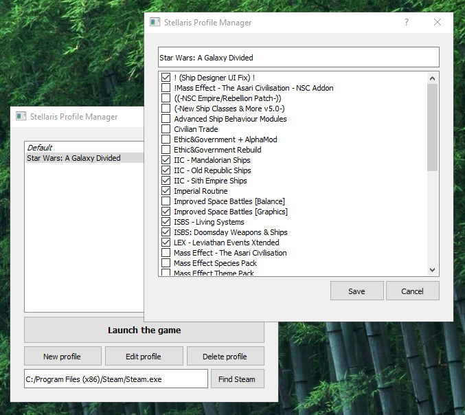

# Stellaris Profile Manager

Profile manager for [Stellaris](http://store.steampowered.com/app/281990/) game to let you switch between different mods with ease.



## Prerequisites
- Python 3.5+

## Installation

Clone the source locally:
```bash
$ git clone https://github.com/danaketh/stellaris-profile-manager.git
$ cd stellaris-profile-manager
```

Install the dependencies:
```bash
$ pip install -r requirements.txt
```
## Run

Just have Python to run the script:
```bash
$ python run.py
```

## Build

On Windows that is what we the the PyInstaller for. You'll need to have Python 3.5 installed to do that since 3.6
is not yet supported.

```bash
$ pyinstaller run.py --noconsole --onefile --paths <PATH_TO_QT5_DLLS>
```

Then, after the app is built for the first time, you can simply use the spec file to build it:

```bash
$ pyinstaller run.spec
```